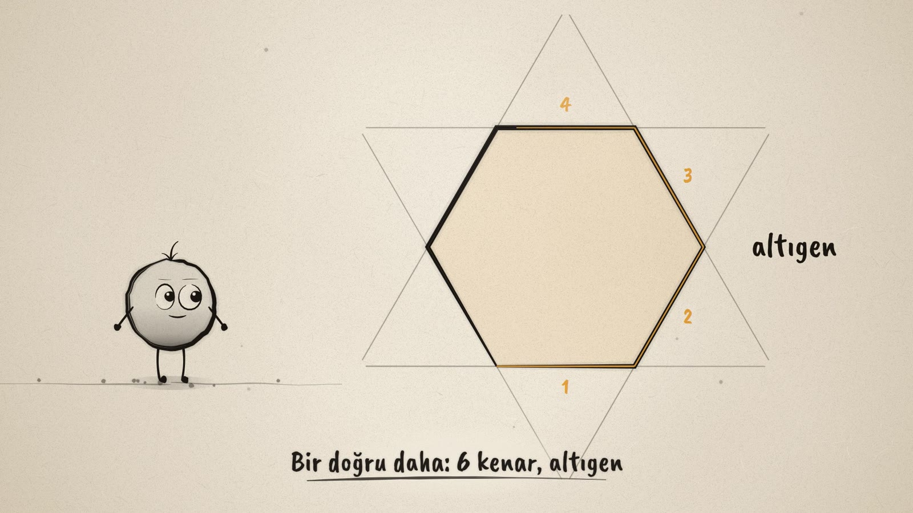
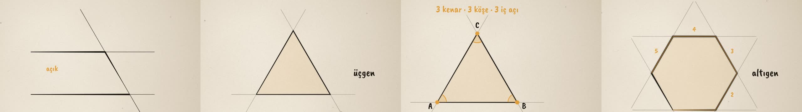

# Doğrulardan Çokgene · From Lines to Polygons

**▶ Tarayıcıda izleyin / Watch in the browser:** https://hakanatas.github.io/dogrulardan-cokgene/ 
**⬇ MP4 + altyazılar / MP4 + subtitles:** [Releases](https://github.com/hakanatas/dogrulardan-cokgene/releases) 
**✎ Kullanılan istem / The prompt behind it:** [PROMPT.md](PROMPT.md)

> **TR —** 5. sınıf matematik "Geometrik Şekiller" temasındaki MAT.5.3.5 öğrenme çıktısı için hazırlanmış, tamamen JavaScript ile çizilen 92 saniyelik mürekkep animasyonu. Nokta doğruları art arda kesiştiriyor. Son doğru ilk doğruyu kesmezse şekil açık kalıyor, keserse kapalı bir şekil, yani bir çokgen oluşuyor. Önce üçgenin kenar, köşe ve iç açıları sayılıyor. Sonra her yeni doğruyla bir kenar daha ekleniyor: dörtgen, beşgen, altıgen. Film, çokgen olmayan iki örnekle (açık şekil, eğri kenar) bitiyor. Altyazılar Türkçe, İngilizce ya da ikisi birlikte seçilebilir.

A 92-second ink animation for **5th-grade maths**, drawn entirely with JavaScript on an HTML5 canvas. It is the fourth film in the geometry series, after [Noktadan Çembere](https://github.com/hakanatas/noktadan-cembere) (MAT.5.3.1–5.3.2), [Kaç Derece?](https://github.com/hakanatas/kac-derece) (MAT.5.3.3) and [Doğrular Kesişince](https://github.com/hakanatas/dogrular-kesisince) (MAT.5.3.4). Nokta, the ink character from [The Learning Ink](https://github.com/hakanatas/the-learning-ink), is the guide again.

## Learning outcome

MEB, Türkiye Yüzyılı Maarif Modeli, Ortaokul Matematik, 5th grade, "Geometrik Şekiller" theme:

**MAT.5.3.5. Çokgenleri düzlemde ardışık olarak kesişen doğruların oluşturduğu kapalı şekiller olarak yorumlayabilme**
- a) Düzlemde en az üç doğrunun, son doğru ilk doğruyla kesişecek biçimde, ardışık kesişerek oluşturdukları durumları inceler.
- b) … ardışık kesişimleri ile çeşitli çokgenler oluşturur.
- c) Çokgenlerin … ardışık kesişimleri ile meydana geldiğini ifade eder.

The program's notes say to introduce the polygon and its basic parts, to focus on convex polygons, and to have students build triangles, quadrilaterals, pentagons and hexagons by thinking about the number of sides.

## How the animation works (and why it teaches the definition)

The polygon is never drawn as a shape. Each line is stored as a direction and a distance from a centre point. The polygon is simply the region on the centre's side of every line, computed with half-plane clipping. So the definition is literally what the code does. When a new line slides in, it cuts off a corner, and a new side and a new corner appear by themselves.

## Designed to be easy to follow

- One idea per scene, with a single short caption on screen at a time.
- The same colour rule as the earlier films: **black ink = lines and sides**, **amber = counting and measuring** (side numbers, corners, inside angles).
- The film starts with a counter-example: when the last line misses the first, the shape stays open. The fix (turning that line until it meets the first one) is the definition itself.
- Every new polygon is counted side by side, 1, 2, 3…, before it is named.

## Scenes

| # | Time | Scene | What happens | Outcome |
|---|---|---|---|---|
| 1 | 0–8 s | Bir doğru | Nokta is born from a drop of ink and draws the first line. | Intro |
| 2 | 8–24 s | Açık mı, kapalı mı? | Three lines cross one after another, but the last one misses the first, so the shape is **open**. It turns until it meets the first line, closing a **triangle**. | 5.3.5 a |
| 3 | 24–40 s | Çokgenin elemanları | 3 **sides** (kenar), 3 **corners** (köşe) A, B, C, and 3 **inside angles** (iç açı). | Parts of a polygon |
| 4 | 40–58 s | Bir doğru daha | Each new line cuts off a corner: **dörtgen** (4), **beşgen** (5), **altıgen** (6). The sides are counted each time. | 5.3.5 b |
| 5 | 58–74 s | Adını kenar sayısı verir | The four polygons side by side with their names. The number of sides, corners and inside angles is always the same. | 5.3.5 c |
| 6 | 74–84 s | Çokgen değil | An open shape, and a closed shape with a curved side: neither is a polygon. | Non-examples |
| 7 | 84–92 s | Aklında kalsın | "Çokgen: art arda kesişen doğruların kapattığı şekil." Nokta celebrates. | 5.3.5 c |

Kept for the next outcome (MAT.5.3.6, properties of polygons): diagonals, regular polygons, and angle sums.

## Running it

- **Preview:** double-click `index.html` (it works offline). Controls: play/pause, timeline, scene jump, speed, 16:9 or 9:16, and captions Off / TR / EN / TR+EN.
- **MP4:** run `npm install` once, then `npm run export -- --format=horizontal --captions=tr`.
- **Subtitles and narration:** `npm run srt` writes `out/captions_*.srt` and `narration_notes.txt`.
- **Editing:**
  - Caption text, timings and narration notes: `captions.js`
  - Scenes: `scenes/scene1.js` … `scene7.js`
  - The lines over time (`lines`), polygon clipping (`polygon`), counting and Nokta's poses: `src/draw/film.js`
  - Layout for 16:9 and 9:16: `src/draw/kd.js`

It uses the same engine as The Learning Ink: `renderFrame(t)` as a pure function of time, seeded randomness, and frame-by-frame export.
